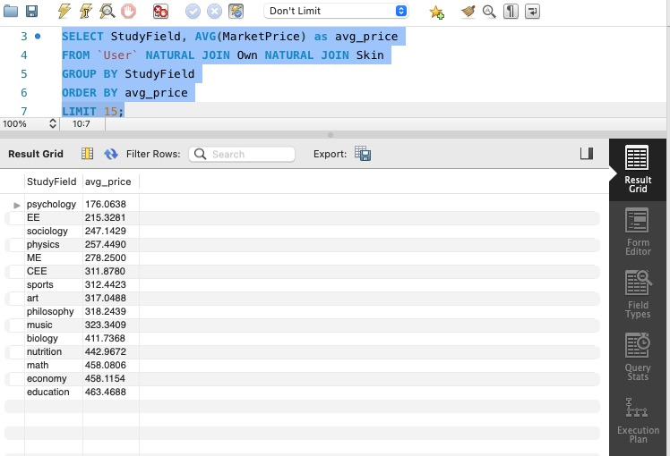
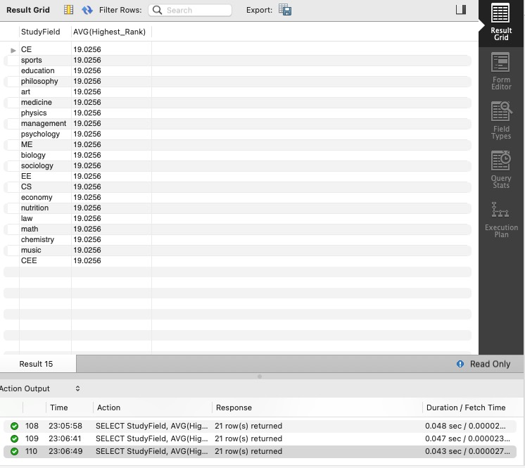

# Database Design
## Database on GCP

## Data Definition Language (DDL)
### User
```sql
CREATE TABLE `User` (
    UserId INT NOT NULL ,
    Sex VARCHAR(10),
    `Name` VARCHAR(30), 
    Contact VARCHAR(30), 
    StudyField VARCHAR(10), 
    Credit INT,
    PRIMARY KEY (UserId)
);
```
### Language
```sql
CREATE TABLE `Language`(
	LanguageId INT NOT NULL,
    `Name` VARCHAR(30),
    PRIMARY KEY (LanguageId)
);
```
### Speak
```sql
CREATE TABLE Speak(
	UserId INT NOT NULL,
    LanguageId INT,
    PRIMARY KEY (UserId),
    FOREIGN KEY (UserId) REFERENCES `User`(UserId),
    FOREIGN KEY (LanguageId) REFERENCES `Language`(LanguageId)
);
```
### Login
```sql
CREATE TABLE Login(
	Email VARCHAR(30) NOT NULL, 
	`Password` VARCHAR(30), 
    UserId INT,
    PRIMARY KEY (Email),
    FOREIGN KEY (UserId) REFERENCES `User`(UserId)
);
```
### Use
```sql
CREATE TABLE `Use`(
	UserId INT NOT NULL,
	Email VARCHAR(30), 
    PRIMARY KEY (UserId),
    FOREIGN KEY (UserId) REFERENCES `User`(UserId),
    FOREIGN KEY (Email) REFERENCES Login(Email)
);
```
### Teams
```sql
CREATE TABLE Teams(
	TeamId INT NOT NULL, 
	FoundTime Date, 
    FounderId INT, 
    NumMenber INT, 
    `LanguageId` INT, 
    Lowest_Rank INT, 
    Highest_Rank INT,
    PRIMARY KEY (TeamId),
    FOREIGN KEY (FounderId) REFERENCES `User`(UserId),
    FOREIGN KEY (`LanguageId`) REFERENCES `Language`(LanguageId)
);
```
### Belong
```sql
CREATE TABLE Belong(
	UserId INT NOT NULL,
    TeamId INT NOT NULL,
    PRIMARY KEY (UserId,TeamId),
    FOREIGN KEY (UserId) REFERENCES `User`(UserId),
    FOREIGN KEY (TeamId) REFERENCES `Teams`(TeamId)
);
```
### Skin
```sql
CREATE TABLE Skin(
	SkinId INT NOT NULL, 
    WeaponType VARCHAR(30), 
    MarketPrice Decimal, 
    Credit_Suggest INT, 
    SkinName VARCHAR(30),
    PRIMARY KEY(SkinId)
);
```
### Own
```sql
CREATE TABLE Own(
	UserId INT, 
    SkinId INT,
    PRIMARY KEY(UserId,SkinId),
    FOREIGN KEY (UserId) REFERENCES `User`(UserId),
    FOREIGN KEY (SkinId) REFERENCES Skin(SkinId)
);
```
### Transaction
```sql
CREATE TABLE `Transaction`(
	Lender INT NOT NULL, 
    Borrower INT NOT NULL,
    SkinId INT,
    StartTime Date, 
    EndTime Date, 
    CreditPledged INT,
    PRIMARY KEY (Lender, Borrower),
    FOREIGN KEY (Lender) REFERENCES `User`(UserId),
    FOREIGN KEY (Borrower) REFERENCES `User`(UserId),
    FOREIGN KEY (SkinId) REFERENCES Skin(SkinId)
);
```
### Comment
```sql
CREATE TABLE `Comment`(
	`From` INT, 
	`To` INT, 
	CommentDate Date, 
    Content VARCHAR(100), 
    Rating INT,
	FOREIGN KEY (`From`) REFERENCES `User`(UserId),
    FOREIGN KEY (`To`) REFERENCES `User`(UserId)
);
```

## Inserting at least 1000 Rows

## Advance Query
### Advance Query1
Which Major is the Richest？
```sql
SELECT StudyField, AVG(MarketPrice)
FROM `User` NATURAL JOIN Own NATURAL JOIN Skin
GROUP BY StudyField
```


### Advance Query2
Which Major Makes English Speaking Pro Team Plays Better?
```sql
SELECT StudyField, AVG(Highest_Rank)
FROM `User` NATURAL JOIN
(SELECT TeamId, Highest_Rank
FROM Teams
WHERE `Language` = 'English' AND Lowest_Rank > 10) as engproteams
GROUP BY StudyField
```



## Indexing 

#### For query 1

```sql
EXPLAIN ANALYZE
SELECT StudyField, AVG(MarketPrice) as avg_price
FROM `User` NATURAL JOIN Own NATURAL JOIN Skin
GROUP BY StudyField
ORDER BY avg_price;
	
```


1. The 1st query without index is shown below.


2. Added index on MarketPrice of Skin table, which might be able to reduce the join cost. But it just slightly decreases the time for first step.
```sql
CREATE INDEX index_marketprice ON Skin (MarketPrice);
```


3. Added index on UserId of Own table, which might be able to reduce the join cost. But it slightly decreases the time for first step and the aggregation.
```sql
CREATE INDEX index_nt ON Own (UserId);
```


4. Added index on StudyField of User table, which still just slightly decreases the time for first step and the aggregation. We think the process of inner join could not be eliminated by an index.
```sql
CREATE INDEX index_StudyField ON `User` (StudyField);
```

------

#### For query 2
```sql
EXPLAIN ANALYZE
SELECT StudyField, AVG(Highest_Rank)
FROM `User` NATURAL JOIN
(SELECT TeamId, Highest_Rank
FROM Teams
WHERE `Language` = 'English' AND Lowest_Rank > 10) as engproteams
GROUP BY StudyField
```
1. The 1st query without index is shown below.


2. Added index on StudyField of User table, which might be able to reduce the join cost. But it has no thing to do with final cost.
```sql
CREATE INDEX index_StudyField ON `User` (StudyField);
```


3. Added index on Highest_Rank, which slightly decreases the time for first step while has no thing to do with cost.
```sql
CREATE INDEX index_Highest_Rank ON Teams (Highest_Rank);
```


4. Added index on Language, which still slightly decreases the time for first step. Costs a lot for last step.
```sql
CREATE INDEX index_l ON Teams (Language);
```

------

#### Conclusion

We think it always cost more on the join step and add a key with that affects join and aggregation would help a lot.
