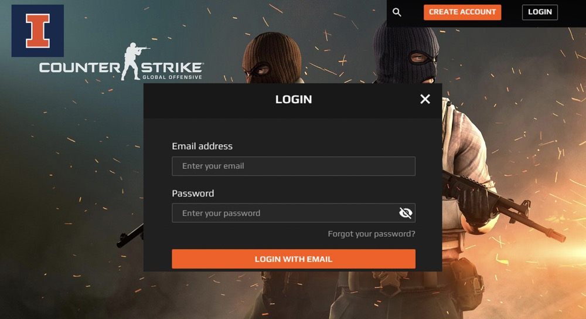

# Happy CSGO: Enable UIUC CSGO Players to Have Fun

## Project Summary
A web app that enables UIUC CSGO fans to communicate with each other and find teammates with similar proficiency skills. It also removes obstacle when you are tired of your own skin and want to switch skins with trust of your classmates!

## Project Description
At UIUC, many CSGO players have not joined e-sports clubs, and their native languages are also different (the same native language is extremely important in CSGO, which requires frequent communication), so it is difficult to find teammates with similar levels, easy communication and matching roles. We hope to create a personal image of every csgo enthusiast through this website, so that every csgo player of UIUC can find suitable teammates. 

Besides, this project also uses the mechanism of point pledge to promote barrier-free skin exchange and play under the condition of roughly trusting each other, and improve the game experience of each player for free.

## Usefulnesss
* We are pioneers in this area. There is no such a site focusing on college CSGO players before.
* We have developed a skin exchange service for students with limited financial circumstances. 
* A forum for free communication and matching has been developed for the pain point of finding suitable teammates.

## Realness
* We will mine each player's role division, rifle usage, and rank level from the CSGO forum to generate a real player profile. 
* The prices of firearms and agent skins will be obtained from steam or a third-party trading market, so as to set the number of points that need to be pledged.

## Functionality Description 
### Data stored in the database

1. Basic personal imformation for each player: fundamental imformation which can help link your UIUC account with your CSGO account  
* Real_name
* NetID
* Game_ID
* Language

2. In-game data: the most important part for our matching system and find all potential player with similar proficiency skills
* Rank level
* Credit_in_game
* Overall_KD
* Playing_now

3. Preference: match other players by invisible key -- players with similar habits may communicate more easily and with different habits may require more coorperation. 
* Role division
* Rifle usage
* Map selection  
* Usually_playing_time

4. Skin information: in CSGO, skins do not determine your proficiency skills so these will also link to the first data base to implement another function.
* SkinID
* Priceinmarket

### Basic functions of our website

1. match teammates with similar proficiency skills
* Link 1,2 and 3 in "Data stored" part
* Check whether they are in game or offline

2. help find schoolmates who can switch skins 
* Link 1 with 4 in "Data stored" part
* select skins with similar price

### Good creative component
* Each user can set his/her playing_now to show whether he/she is playing CSGO now.
* Recommend similar users by the rank level and usually_playing_time, the system will recommend this automatically.
* Offer chance to player with different or similar preferences by themselves to get exciting experience. 
 
## Low Fidelity UI Mockup

## Project work distribution:  

* Bolin Zhang -- Front-End and Website Function Design
* Jiahao Fang -- DB Design and Implemention
* Shitian Yang –- Retrieving Data From Other Websites
* Wenhan Jiang -- DB Design and Implemention

Distribution above may change dynamically considering workload.
